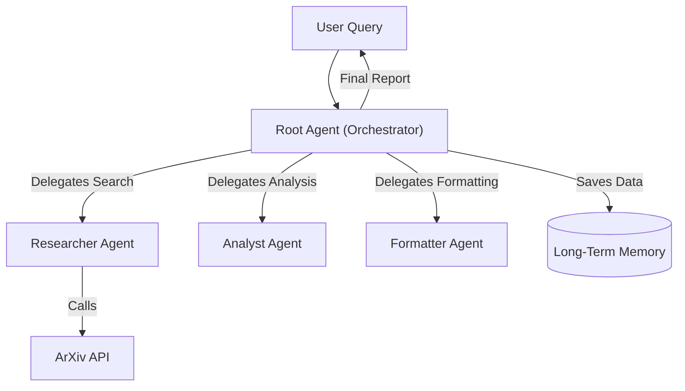

# 🎓 Multi-Agent Research Assistant

An advanced AI agent system designed to automate the academic research process. Powered by **Google Gemini 2.5**, this project uses a **multi-agent architecture** to search for papers, analyze publication trends, format citations, and persist findings.

## 🚀 Features

* **Multi-Agent Architecture**: Specialized agents working in concert:
    🕵️ **Researcher**: Searches ArXiv for relevant papers (supports parallel queries).
    📊 **Analyst**: Analyzes data (e.g., publication year distribution) and generates ASCII charts.
    📝 **Formatter**: Formats raw paper data into proper APA citations.
    🧠 **Root Agent**: Orchestrates the workflow and manages memory.

* **Tools & Integrations**:
    **ArXiv API**: Real-time access to millions of academic papers.
    **Long-Term Memory**: Persists findings to a JSON knowledge base.
    **Parallel Execution**: Simulates concurrent research tasks for efficiency.

* **Deployment Ready**:
    Run locally via **Flask API**.
    Deploy to production on **Google Cloud Vertex AI Agent Engine**.
    Interactive testing via **ADK Web UI**.

## 🏗️ Architecture

The system follows a hierarchical multi-agent pattern:



## 🛠️ Tech Stack

* **LLM**: Google Gemini 2.5 Flash Lite
* **Framework**: Google Agent Development Kit (ADK)
* **Language**: Python 3.10+
* **APIs**: ArXiv API
* **Deployment**: Flask, Vertex AI, Docker

## 📦 Installation

1. **Clone the repository**:

    ```bash
    git clone https://github.com/emansarahafi/research-assistant-agent.git
    cd research-assistant-agent
    ```

2. **Install dependencies**:

    ```bash
    pip install google-adk arxiv nest-asyncio google-cloud-aiplatform flask
    ```

3. **Set up API Keys**:
    * You need a Google Cloud Project with Vertex AI enabled.
    * Set your API key as an environment variable:

        ```bash
        export GOOGLE_API_KEY="YOUR_API_KEY"
        ```

## 💻 Usage

### Option 1: Jupyter Notebook

Run the `research-assistant-agent.ipynb` notebook to step through the entire process, from agent definition to execution and deployment.

### Option 2: Local Flask API

The project includes a Flask wrapper for local testing.

1. Run the Flask server code (found in Section 7 of the notebook).
2. Send a POST request:

    ```bash
    curl -X POST http://localhost:5003/chat \
      -H "Content-Type: application/json" \
      -d '{"query": "Agentic AI Design Patterns"}'
    ```

### Option 3: Vertex AI Deployment

1. Generate the agent package (Section 6 of the notebook).
2. Deploy using `gcloud`:

    ```bash
    gcloud beta ai agents create \
      --display-name="Research Assistant" \
      --project=$PROJECT_ID \
      --location=$LOCATION \
      --agent-package-path="vertex_agent_deployment/"
    ```

## 📝 License

This project is open-source and available under the [MIT License](LICENSE).

## ❓ Troubleshooting

* **`WARNING:google_genai.types`**: You may see warnings about "non-text parts" in the logs. These are harmless and caused by the agent returning function calls. They are suppressed in the notebook configuration.
* **ADK Web UI 500 Error**: Ensure you run the `!adk web` cell *before* clicking the proxy link.
